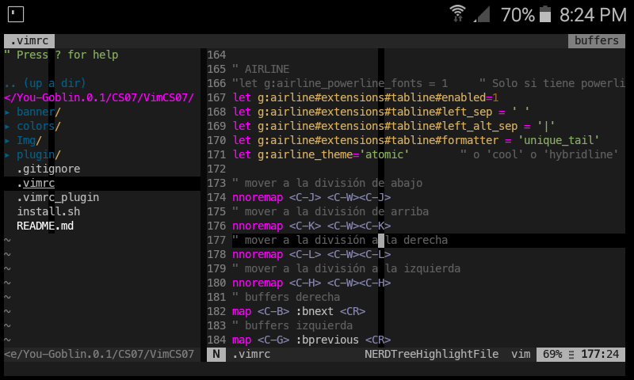
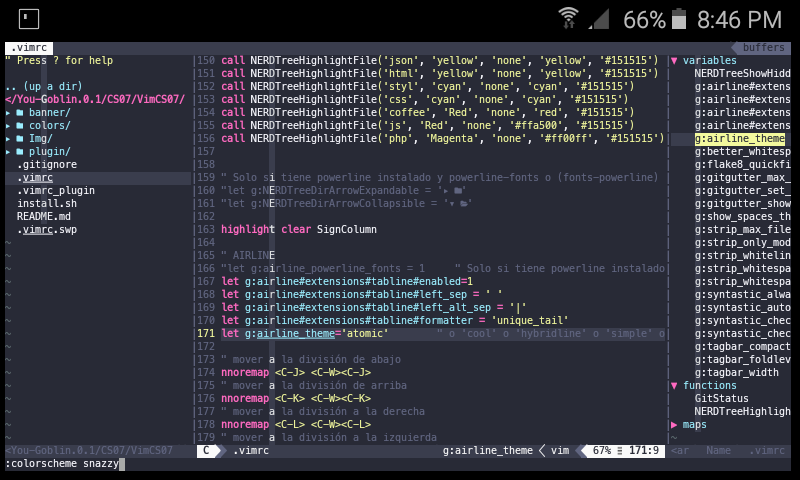

# VimCS07

**VimCS07** es una herramienta hecha en `Bash` que instala, descarga y configurar los mejores complementos que hay para el editor vim, como ser plugin y otros paquetes requeridos.

Este programa fue creado para facilitar la configuración del editor vim.

Requisitos previos
======
Antes de ejecutar la herramienta, es necesario instalar las siguientes utilidades a nivel de sistema:

```
apt install vim git python python2 -y
```
```
pip install flake8
```
Una vez instalado, podrás continuar con el siguiente punto.

`git clone https://github.com/Z3R07-RED/VimCS07.git`

¿Cómo ejecuto la herramienta?
======

```
cd VimCS07/
```

```
chmod +x install.sh
```

```
./install.sh
```

La instalación puede tardar unos segundos.
Al ejecutar el editor vim se verá de esta forma:

<p align="center">

</p>

Temas:
======
puede cambiar el tema con el siguiente comando:

<p align="center">

</p>

En el editor `vim` presione la tecla `ESC` luego ejecute `:colorscheme snazzy`
tambien puede `:colorscheme` luego presione la tecla `TAB` para que se muestren todos los temas disponibles.

Uso del editor:
======
- Tecla `ESC` + `F2` abre una ventana con los archivos y directorios disponibles.
- Tecla `F3` esconde o muestra los números de líneas de un archivo.
- Tecla `ESC` + `F9` abre una ventana y muestra todas las funciones y variables del archivo.
- Tecla `ESC` + `F7` Nueva ventana derecha.
- Tecla `ESC` + `F8` Nueva ventana abajo.
- Tecla `ESC` + `Ctrl+B` buffers derecha.
- Tecla `ESC` + `Ctrl+G` buffers izquierda.

Mas en: `~/.vimrc` para ver todas las configuraciones.

Desinstalar la Configuración:
======

```
cd VimCS07/
chmod +x uninstall.sh
./uninstall.sh
```

Muy simple verdad? ...


